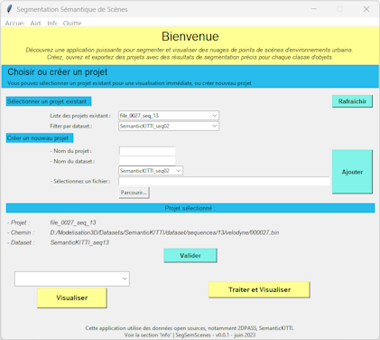
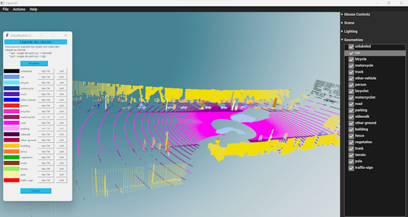
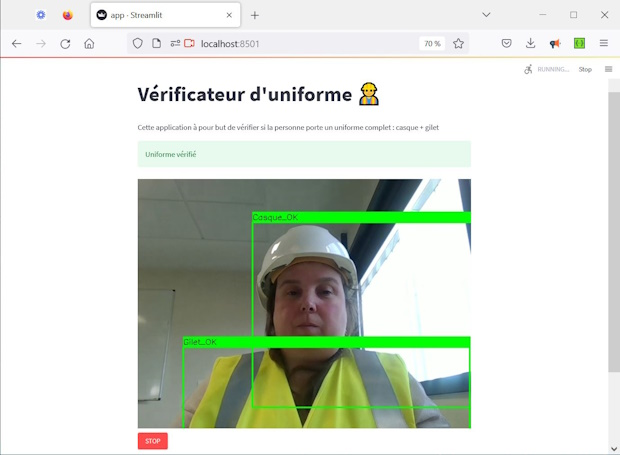
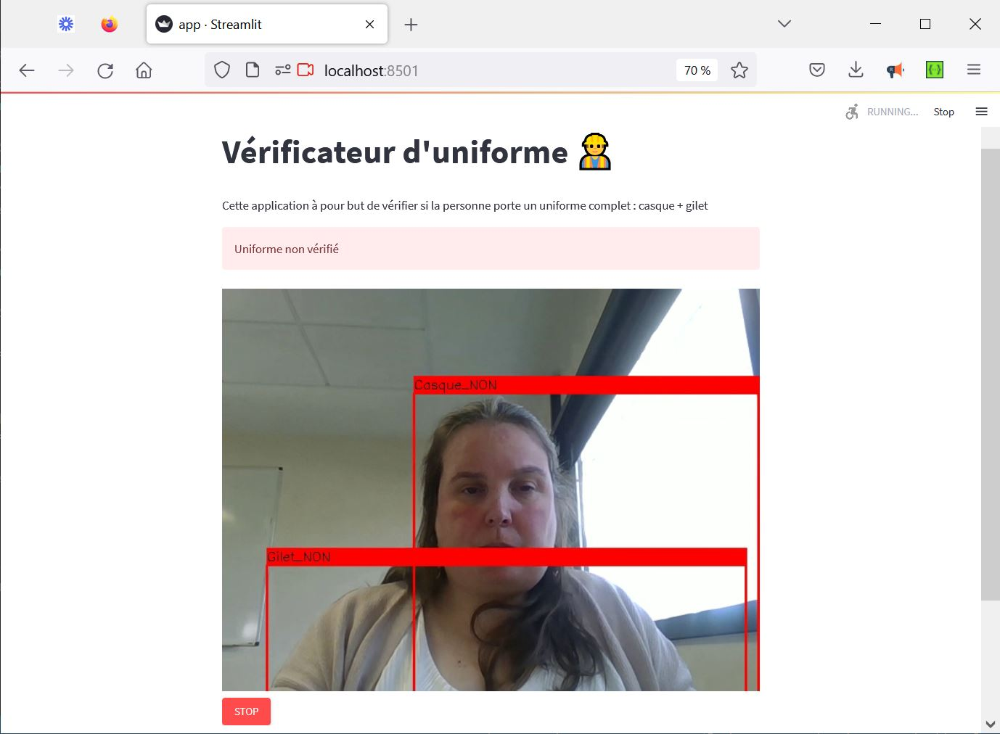

# Portfolio de MainaLD

<h2>1) Traitement de Nuages de Points</h2>
Présentation de l'application de traitement de nuages de points par segmentation sémantique. Projet de recherche dans le cadre de mon alternance au L@bISEN, que j'ai également présenté comme projet chef-d'œuvre pour l'obtention de mon diplôme de développeuse en intelligence artificielle. 

- Lien vers la présentation : <a href="https://drive.google.com/file/d/1HWaCDoZdQkt2sv8ooS2gg-9OwQ0G_HAK/view?usp=sharing">Traitement de Nuages de Points</a>  
   
  
 

- Lien vers la vidéo de démonstration : [Vidéo Traitement de Nuages de Points](https://drive.google.com/file/d/1mqZdktI6f4tK4OHqnsfaPELKAVFVmtPQ/view?usp=sharing) 
    

<h2>2) Cas Pratique : Vérificateur d’uniforme</h2>

Pour l'obtention de mon diplôme de développeuse en intelligence artificielle, j'avais pour objectif d'améliorer une application existante.   
L'application doit permettre de contrôler que le port de l'uniforme est conforme : port du casque et du gilet. Dans la version de base, elle ne permettait pas de détecter les gilets (app_original.py). 
Après avoir repris la labellisation des images en ajoutant le label "gilet", puis augmenté le dataset (accès restreint), j'ai entraîné différents modèles de l'algorithme YOLOv5 avec différents hyperparamètres pour obtenir le "meilleur" modèle pour la prédiction.  J'ai ainsi déployé le modèle YOLOv5s_b64 dans la nouvelle application de Streamlit, car il obtenait le meilleur compromis entre sa taille et ses performances. 
Lien vers le projet : <a href="https://github.com/MainaLD/Cas_pratique_Verificateur_d_uniforme#cas-pratique--v%C3%A9rificateur-duniforme">Projet Vérificateur d’Uniforme</a> 

<h2>3) Projet n°18 : Modèle IA Detection Masks - version 2</h2>

Il s'agit de l'évolution d'un précédent projet. Application avec Streamlit et OpenCV de Transfer Learning pour la détection des masques. 
Contexte du projet : Nous cherchons à améliorer l’application développée au projet 14 (Modèle Détection Masques). L'objectif est de développer une application Streamlit capable de détecter et localiser le ou les visages dans une image, puis de déterminer la présence ou l'absence du masque pour chaque visage détecté. 
Lien vers le projet : <a href="https://github.com/MainaLD/18_Model_IA_detection_masks_2">Projet Modèle IA Detection Masks 2</a>

