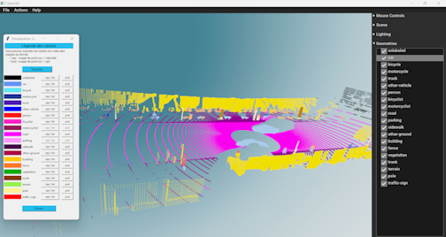

# Portfolio de MainaLD
Ci-dessous une liste exhaustive de projets (briefs) réalisés dans le cadre de ma formation de développeur en Intelligence Artificielle.

## [1) Traitement de Nuages de Points](https://github.com/MainaLD/Traitement_nuages_de_points)
Application de traitement de nuages de points par segmentation sémantique, réalisé dans le cadre de mon année d'alternance au L@bISEN.
Elle est développée sur Tkinter et elle est basée sur l'architecture 2DPASS.

## [2) YOLOv5 : Vérificateur d’uniforme](https://github.com/MainaLD/Yolov5s_Verificateur_uniforme_CasPratique)
Application permettant de contrôler si le port de l'uniforme est conforme : port du casque et du gilet.
Elle est développée sous l'interface Streamlit et utilisant l'algorithme YOLOv5.
 

## [CNN : Detection de masques - version 2](https://github.com/MainaLD/CNN-Detection_masks_v2_Breif18) (Brief n°18)
Application avec Streamlit et OpenCV, utilisant un CNN (VGG16 et les poids d'ImageNet) pour la détection des visages puis le port du masque.

## [Bases de données : SQL / NoSQL](https://github.com/MainaLD/Creation_et_Gestion_de_BDD)
Sélection de Projets (briefs) de conception avec Merise, de création et de gestion de bases de données SQL et NoSQL.
- Merise et MySQL : Gestion des Stocks IKEO avec une BDD (Brief n°4)
- Docker, MySQL et GRAFANA : Tableau de bord sur la Covid (Brief n°15)
- MongoDB : Base de publications scientifiques (Brief n°17)

## [Projets : Htlm/Css/Flask](https://github.com/MainaLD/Html-Css-Flask)

Sélection de Projets de pages web créées en utilisant HTML/CSS et Flask.
- Une page de promesses de dons (Brief n°2)
- Pour quelques promesses de dons de plus (Brief n°6)
- Breizhibus : Gestion des lignes de bus en ligne (Brief n°10)
